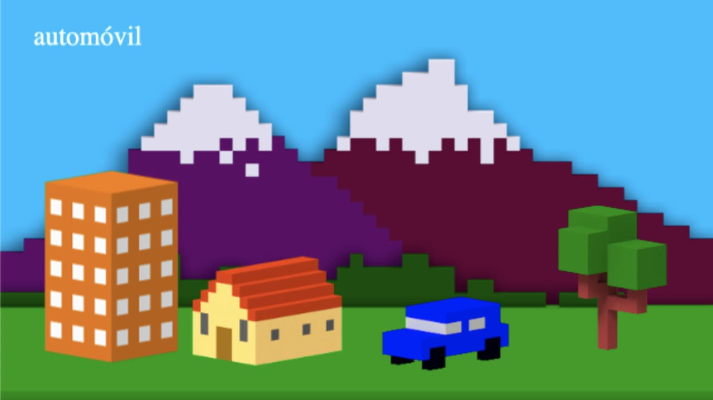

# Create a Spanish Teaching Game with Phaser 3

Zenva Course URL: https://academy.zenva.com/course/create-a-spanish-teaching-game-with-phaser-3/

HTML5 game framework Phaser: https://phaser.io/

Audio assets: https://freesound.org/ and https://audiojungle.net/

Audio software: https://www.audacityteam.org/

[Click here](https://frenzzy.github.io/edu-game-phaser3-spanish-teaching/public/) to play a Spanish Teaching game:

[Click here](https://academy.zenva.com/certificate/ec1c8807b99f) to see the certificate of completion:

